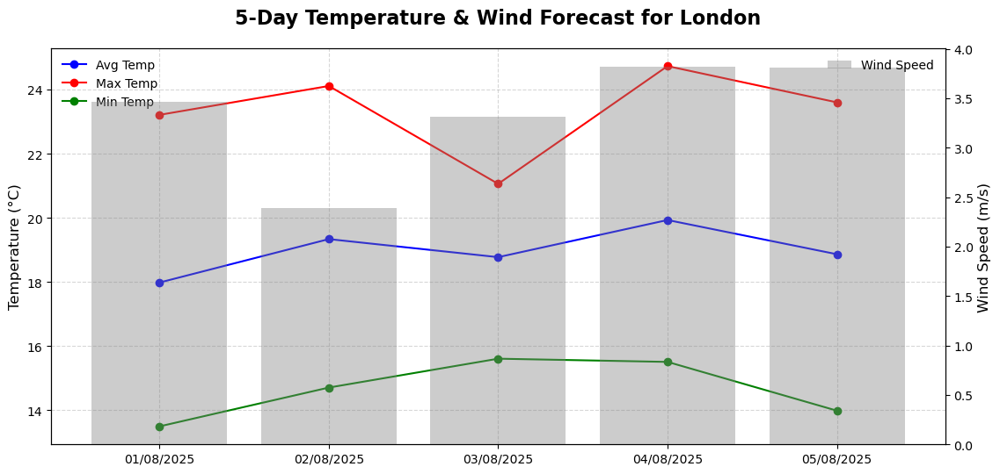
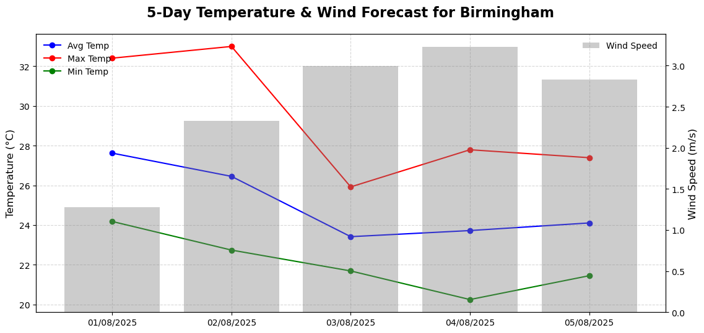
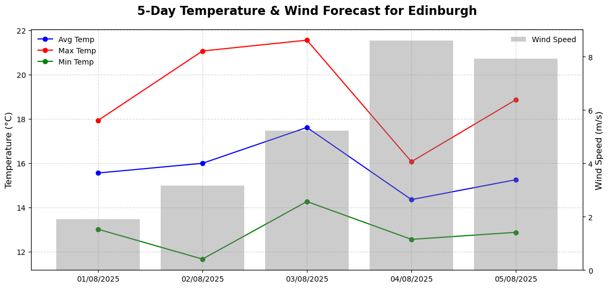
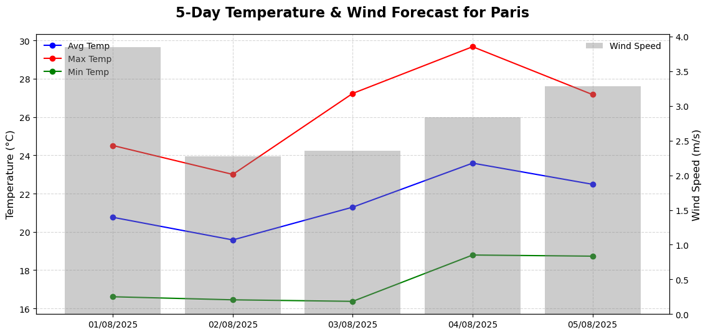
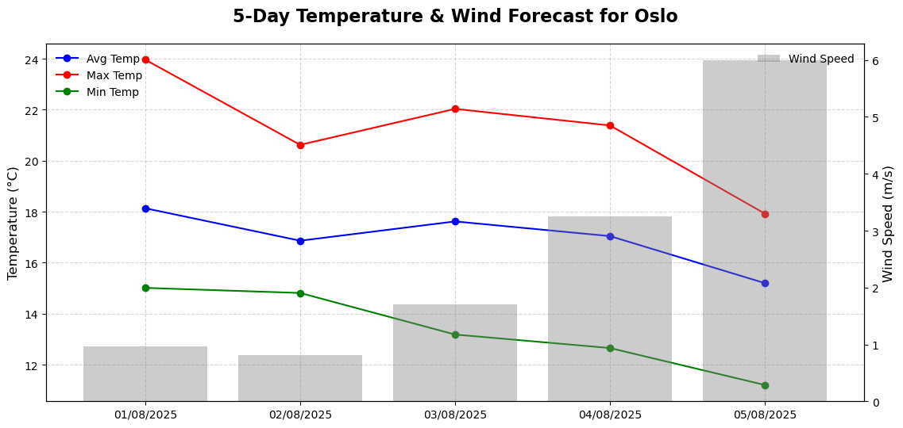

# Visualizing weather data from OpenWeatherMap
OpenWeatherMap is an online service, owned by OpenWeather Ltd, that provides global weather data via API, including current weather data, forecasts, nowcasts, and historical weather data. The company provides a minute-by-minute hyperlocal precipitation forecast.
https://openweathermap.org/
```
import os
import requests
from datetime import datetime
from dotenv import load_dotenv
import matplotlib.pyplot as plt
from collections import defaultdict

# To get forcast file for specific city from Open Weather Map (OWM)
def get_forecast(city, api_key):
    url = f"https://api.openweathermap.org/data/2.5/forecast?q={city}&appid={api_key}&units=metric"
    response = requests.get(url)
    return response.json()

# Calculate average wind speed and temperature, max and minimum temperature
# for a specific date from 3 hourly forcast data
def calculate_daily(data):
    # adding individual variables into dictionary
    hourly_temp = defaultdict(list)
    hourly_temp_max = defaultdict(list)
    hourly_temp_min = defaultdict(list)
    hourly_wind = defaultdict(list)
    for entry in data["list"]:
        dt = datetime.fromtimestamp(entry["dt"])
        day = dt.strftime("%d/%m/%Y")
        temp = entry["main"]["temp"]
        temp_max = entry["main"]["temp_max"]
        temp_min = entry["main"]["temp_min"]
        wind_speed = entry["wind"]["speed"]
        hourly_temp[day].append(temp)
        hourly_temp_max[day].append(temp_max)
        hourly_temp_min[day].append(temp_min)
        hourly_wind[day].append(wind_speed)
    daily_temp_avg = {}
    daily_temp_max = {}
    daily_temp_min = {}
    daily_wind_avg = {}
    for day, temps in list(hourly_temp.items())[:5]:
        avg_temp = sum(temps) / len(temps)
        daily_temp_avg[day] = avg_temp
    for day, temps in list(hourly_temp_max.items())[:5]:
        max_temp = max(temps)
        daily_temp_max[day] = max_temp
    for day, temps in list(hourly_temp_min.items())[:5]:
        min_temp = min(temps)
        daily_temp_min[day] = min_temp
    for day, winds in list(hourly_wind.items())[:5]:
        avg_wind = sum(winds) / len(winds)
        daily_wind_avg[day] = avg_wind
    return daily_temp_avg, daily_temp_max, daily_temp_min, daily_wind_avg


def plot_forecast(daily_temp_avg, daily_temp_max, daily_temp_min, daily_wind_avg, city):
    days = list(daily_temp_avg.keys())
    temps_avg = list(daily_temp_avg.values())
    temps_max = list(daily_temp_max.values())
    temps_min = list(daily_temp_min.values())
    wind_avg = list(daily_wind_avg.values())

    plt.figure(figsize=(11.5, 5.5))
    ax = plt.gca()

    # Plot temperature lines
    ax.plot(days, temps_avg, marker='o', color='blue', linestyle='-', label='Avg Temp')
    ax.plot(days, temps_max, marker='o', color='red', linestyle='-', label='Max Temp')
    ax.plot(days, temps_min, marker='o', color='green', linestyle='-', label='Min Temp')
    ax.set_ylabel("Temperature (°C)", color='black', fontsize=12)
    ax.tick_params(axis='y', labelcolor='black')
    ax.set_xticks(range(len(days)))
    # ax.set_xticklabels(days, rotation=45)
    ax.set_xticklabels(days)

    # Legend for temperature
    temp_legend = ax.legend(loc='upper left', bbox_to_anchor=(0, 1), frameon=False)

    # Wind bar plot on secondary Y-axis
    ax2 = ax.twinx()
    ax2.bar(range(len(days)), wind_avg, color='gray', alpha=0.4, label='Wind Speed')
    ax2.set_ylabel("Wind Speed (m/s)", color='black', fontsize=12)
    ax2.tick_params(axis='y', labelcolor='black')

    # Legend for wind speed
    wind_legend = ax2.legend(loc='upper right', bbox_to_anchor=(1, 1), frameon=False)

    # Title and layout
    plt.title(f"5-Day Temperature & Wind Forecast for {city}", pad=20, fontweight='bold', fontsize=16)
    ax.grid(True, linestyle='--', alpha=0.5)
    plt.tight_layout()
    plt.savefig(f'{city}_forecast.png', bbox_inches='tight')

# Main
def main():
    load_dotenv(dotenv_path="openweather_api_key.env")  # Load from .env file
    API_KEY = os.getenv("OPENWEATHER_API_KEY")
    # city = input("Enter city name (default London): ").strip() or "London"
    cities = ["London", "Birmingham", "Edinburgh", "Paris", "Milan", "Oslo"]
    for city in cities:

        try:
            forecast = get_forecast(city, API_KEY)
            if forecast.get("cod") != "200":
                print("Error:", forecast.get("message", "Failed to fetch forecast."))
                return

            temp_avg, temp_max, temp_min, wind_avg = calculate_daily(forecast)
            print("\n Average Temperature Forecast ({}):".format(city))
            print(f"{'Date':<12} {'Avg Temp (°C)':<15} {'Wind Speed (m/s)':<18}")
            print("-" * 45)
            for day in temp_avg:
                temp = temp_avg[day]
                wind = wind_avg.get(day, 0.0)  # default to 0.0 if missing
                print(f"{day:<12} {temp:<15.1f} {wind:<18.1f}")

            plot_forecast(temp_avg, temp_max, temp_min, wind_avg, city)

        except Exception as e:
            print("Error:", e)


if __name__ == "__main__":
    main()
```
### Example plots






